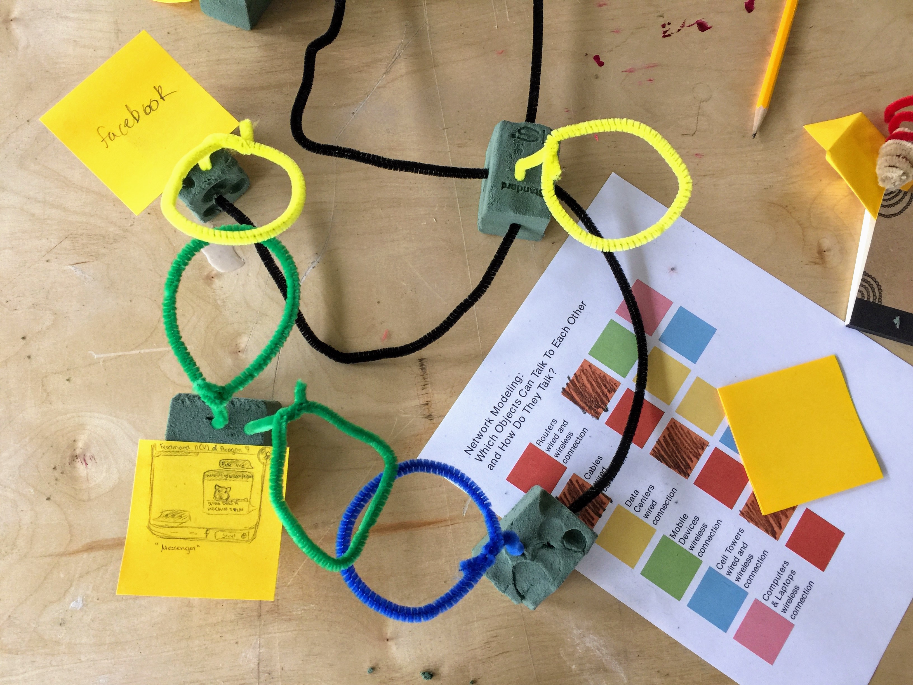

# Understanding The Internet • by [Jonathan Dahan](http://jedahan.com/)

## Description / Essential Questions
Through a series of embodied exercises students will replicate core components of the internet and the infrastructure behind it. The exercise is intended to provide a peek inside the black box, examine the history and decisions that were made during the invention of the network and reimagine how it could have been constructed differently and what the possible outcomes could have been? 

### Target Audience / Prerequisite & Pre-Assessment
This is intended for high school aged children, 14 - 18. Participants should be familiar with the internet as users (facebook, email, cell phones) but should not be fluent with 'how' they work.

### Duration
This exercise, 'Understanding the Network', is 1 of 3 and can be taught seperately or combined with the others for a longer program.

* :15 Overview, context and examples/prompts.
* :30 Instruction & hands on exercise. 
* :15 Wrap-up discussion & sharing, focus on vocabulary. Reflection, additional challenges or next steps

### Outcomes & Goals
After this workshop, students will...
* Be able to visualize and show how they think the internet works
* Articulate their designs and iterate on their network models with feedback
* Work as a group to help each other uncover the things we don't know about the internet
* Have a broader vocabulary about the infrastructure that makes the internet work
* Be able to apply this knowledge and language to future exercises and classes

### Materials
* [Printed Instructions](http://networks.land/handouts/colors-for-blocks.pdf)
* [pipe cleaners](https://www.amazon.com/gp/product/B01GK0Z8XW/ref=as_li_tl?ie=UTF8&camp=1789&creative=9325&creativeASIN=B01GK0Z8XW&linkCode=as2&tag=eye013-20&linkId=0a4b2fc6e7196ea3c94bc6a1edf9107f) or [yarn](https://www.amazon.com/gp/product/B016O6U3OG/ref=as_li_tl?ie=UTF8&camp=1789&creative=9325&creativeASIN=B016O6U3OG&linkCode=as2&tag=eye013-20&linkId=1fae5a860734fa2b7a83167f56ef411b)
* [floral crafting foam blocks](https://www.amazon.com/gp/product/B00GO4W2S4/ref=as_li_tl?ie=UTF8&camp=1789&creative=9325&creativeASIN=B00GO4W2S4&linkCode=as2&tag=eye013-20&linkId=d04cfd1f9a5df82a194daffe5c6557fe)
* post-it notes & pens or colored pencils

### Exercise
Break students into small groups providing access to materials and walk them through the [printed instructions](). We explained that the object was to be creative and build examples of how they think the internet works, not to worry if they were right or accurate. We then gave instruction to use the materials to build physical models of how 'a thing' on the internet worked, specifically, how the information came from point A (the origin) to point B (the screen).

Here are some prompts to get them started (and there are some in the handout) but do encourage them to draw new examples using the sticky notes they are curious about and be creative.
* show how you look at facebook
* show how the videos in the back of taxis work
* show how social media filters work (dancing seagull, puppy face)
* show how google home or amazon alexa works
* show how the giant ads work in times square

While they are building network models, prompt students to show  systems behind the screens they don't see like 'where is the content is coming from' or 'how the screen is getting it's internet connection'?

It's not necessary to label the correct names of objects at this point like 'server' or 'router'.

For examples that take an input like social media filters or amazon alexa, there is a two way conversation. Ask students to think about how these examples incorporate your input in the result it shows. Ask them to show in their models data flowing both ways. 

## Reflections, Takeaways & Next Steps

At the end of the exercise, have each team walk through explaining their model. Use this time to assign labels to objects like (server, router) and ask questions to prompt them to think about ways they can expand their models like "where would that information be stored" or "what happens when there is no internet connectivity like when you are underground in the subway"?

Once each group has finished, challenge them to see if they can get all the networks to talk to each other. 

If you have a longer session or for a follow up exercise, install [Herbivore](https://github.com/samatt/herbivore) on a computer and explore all the data packets that travel between the computer and the internet. You can also easily show the [Global Internet Traffic Report](http://www.internettrafficreport.com/)

Further exercises ***to be published later*** expand on this introduction and walk students through seeing internet traffic, threat modeling and understanding how to be safe online.

## Vocabulary
	A)  Application, Analog, Android
	B)  Bandwidth, Banner, Blog, Bluetooth, Broadband, Browser
	C)  Camera, Cell Phone, Cell Tower, Chat, Code, Carrier Hotel, Computer, Connection, Connectivity, Cookie
	D)  Data, Database, Desktop, Digital, Disk, Display, Domain Name, Download, Drive, Data Center
	E)  E-mail, Electronic, Electronics, Ethernet
	F)  Facebook, Fax, Fiber optic, Firewall, Floppy disk, Freeware
	G)  GIF, Graphics, Google
	H)  Hacker, Hard drive, Hardware, Home page, Host, Hypertext
	I)  Infiltration, Information, Input, Instant Messaging, Integrate, Interface, Internet, Intranet, iPad, iPhone, Internet Exchange, Internet Safety ISP
	J)  JPEG
	K)  Keyboard
	L)  Laptop, Laser, Log in, Log off
	M)  Mainframe, Memory, Modem, Monitor, Mouse
	N)  Navigate, Network
	O)  Off-line, On line, Operating system, Opt out
	P)  Password, Phishing, Pirate, Pixel, Printer, Privacy, Processor, Product, Program, Programmer, Project, Projector, Protocol, Public domain, Purge
	Q)  Query, Queue
	R)  Radio, Ranking, Rate, Record, Refer, Registry, Regulate, Relevancy, Remote, Repair, Research, Resolution, , Retrieval, RAM, ROM, Router
	S)  Safeguard, Satellite, Save, Scan, Screen, Screen saver, Script, Search, Search engine, Security, Software, Source, Spam, Speed, Spyware, Surfing, System, Server
	T)  Tech, Technology, Telephone, Television, Terminal, Twitter
	U)  Update, Upload, User ID, Username
	V)  Video conference, Virtual, Virus
	W)  Webmaster, Webpage, Website, Windows, Wireless, World Wide Web
	X)  
	Y)  YouTube
	Z)  

## Additional resources
* Idea for this workshop is based on Ingrid Burrington and Surya Mattu's project [Networks Land](http://networks.land/)
* [The Internet Explained](https://sonet.digital/articles/internet-explained/), A few articles that explain the timeline and growth of the interntet from Arpanet to the web browser, DNS and the future of the internet. 
* [Internet History for CS Teachers](https://livestream.com/internetsociety/ihforcs), materials are still in development but the kickoff video (:45) by David J Farber is a first hand account of how the Internet was developed by someone who was directly involved in that process.
* [How the Internet Came To Be](http://netvalley.com/archives/mirrors/cerf-how-inet.html), written by Vinton Cerf
* [The History of The Internet](https://www.internetsociety.org/internet/history-internet/brief-history-internet/), A brief history written by some of the people involved in it's development and evolution.
* [How to Go From 0 to Packet Sniffing in 10 Minutes](https://motherboard.vice.com/en_us/article/jpgmxp/how-to-go-from-0-to-sniffing-packets-in-10-minutes)
* [The Motherboard Guide to Not Getting Hacked](https://motherboard.vice.com/en_us/article/d3devm/motherboard-guide-to-not-getting-hacked-online-safety-guide?utm_campaign=pockethits&utm_medium=email&utm_source=pocket)

